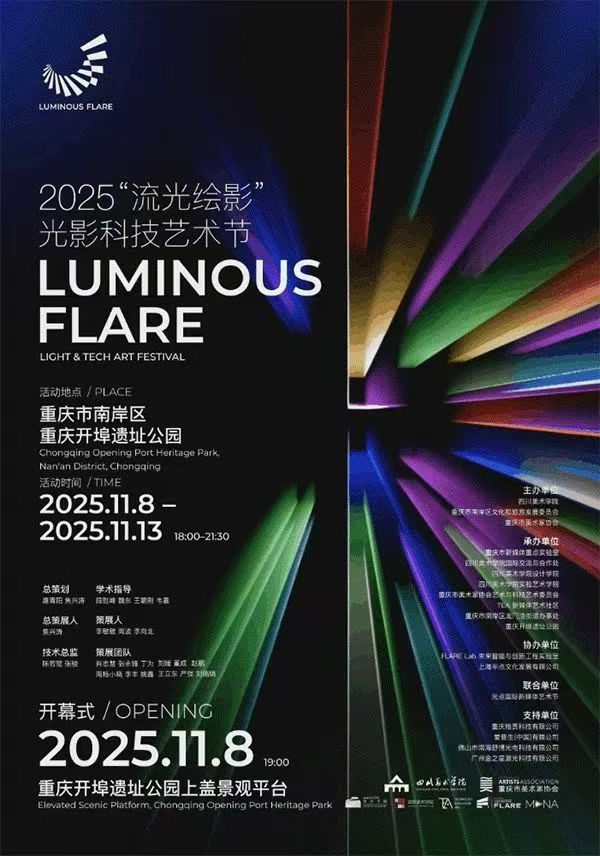

# 已核对外部链接与公开资料索引

> 用于团队侧作品归档、直播分享、对外介绍时的公开来源核对

---

## 使用说明

- 视频链接优先用于直播播放和作品佐证
- 官方活动页优先用于时间、场地、主办信息交叉核对
- 微信原文只收录能够稳定定位到的公开链接

---

## 已核对项目

| 项目 | 类型 | 链接 | 说明 |
|------|------|------|------|
| 滴流 Drop Flow 1.0 | Bilibili 视频 | https://www.bilibili.com/video/BV12tRrYTEYB | 技术验证视频 |
| 滴流 Drop Flow UFO 内部实验版 | Bilibili 视频 | https://www.bilibili.com/video/BV1PREczgEzC/ | 内部展演完整实录 |
| Timer / 时间操纵者 | Bilibili 视频 | https://www.bilibili.com/video/BV1SWvhenErp/ | 公开视频 |
| 首届中国（杭州）艺术与科技国际双年展 | 官方活动页 | https://www.caa.edu.cn/info/1198/171082.htm | 中国美术学院官方开幕报道 |
| 首届中国（杭州）艺术与科技国际双年展 | 官方活动页 | https://www.yuhang.gov.cn/art/2025/10/19/art_1532136_59159551.html | 余杭区官方报道 |
| 重庆“流光绘影”光影科技艺术节 | 官方活动页 | https://cq.gov.cn/zwgk/zfxxgkml/zdlyxxgk/ggwh/wh/ychdyg/202511/t20251107_15148371.html | 重庆市政府活动预告 |
| 重庆“流光绘影”光影科技艺术节 | 官方活动页 | https://www.cq.chinanews.com.cn/news/2025/1109/39-50443.html | 中新网重庆开幕报道 |
| Kashiwa Daisuke / Can Festival / 深圳 BO LIVE | 官方活动页 | https://kashiwadaisuke.com/2025/10/28/can-festival-shenzhen-bo-live/ | 艺术家官方站活动页，页面含现场图片 |
| Kashiwa Daisuke / Can Festival / 深圳 BO LIVE | 微信原文 | https://mp.weixin.qq.com/s/dJ2Zqer8IABJHwoEIyvLfw | 当前能稳定定位到的公众号原文 |
| Dérive 双城记：Digital Dérive | 项目官网 | https://cityfactory.site/ | 在线展入口 / 项目站 |
| UFO Terminal「加载…」 | 媒体报道 | https://m-news.artron.net/20250522/n1748510.html | 雅昌现场报道，页面含活动图片 |
| UFO Terminal / 上海相关活动页 | 机构活动页 | https://www.shanghaiart.cn/project_detail.aspx?projectid=472 | 活动页，可继续核对图片与时间信息 |

---

## 已入库图片示例

---

## 待继续补齐的微信原文

- UFO Terminal「加载…」相关原文
- 杭州双年展官方公众号原文
- 重庆“流光绘影”官方公众号原文
- Timer 与《观察与共生》的公众号原文

---

## 建议优先抓图的公开页面

- Kashiwa 官方站活动页：适合抓现场照、海报、艺人合作证明图
- 中国美院 / 余杭官方页：适合抓双年展现场图、活动报道图
- 重庆市政府 / 中新网重庆：适合抓流光绘影活动图和报道图
- 雅昌 UFO 报道页：适合抓活动现场图和空间图
- 你自己的 B 站视频页：适合抓封面、关键帧、评论区时间证明

---

*整理日期：2026年3月14日*
